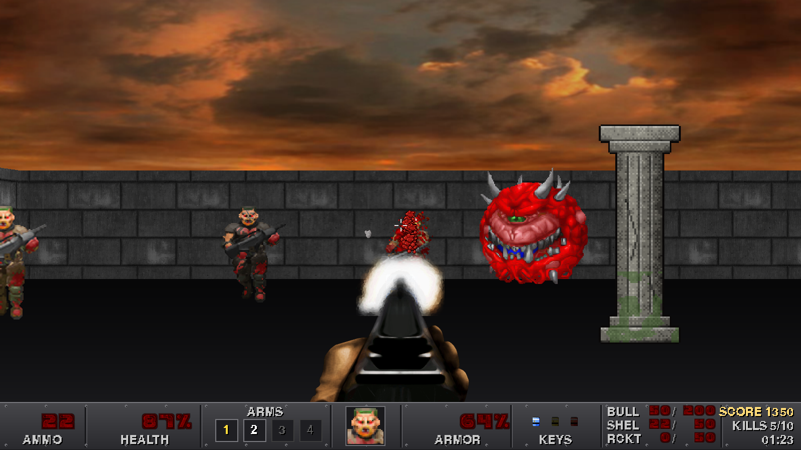

# KnotzDoom

A complete Doom-style first person shooter written in Python with pygame: a
grid raycaster with sliding doors, depth-clipped billboard sprites, six
hand-built levels, four weapons, five monster types, keys, secrets, exploding
barrels, a Doom style status bar, intermission tallies, save games, cheats and
everything in between.



## Running

```bash
pip install -r requirements.txt   # pygame + numpy (pytest for the tests)
python main.py
```

Python 3.10+ and pygame 2.5+ are required. The game runs at 1600x900 in a
window; fullscreen can be toggled with F11 or from the options menu.

## Controls

| Key | Action |
| --- | --- |
| W A S D / arrows | Move, strafe and turn |
| Mouse | Look around |
| Left mouse | Fire (hold for automatic weapons) |
| Shift | Sprint (or toggle "always run" in the options) |
| E / Space | Use doors, switches and secret walls |
| 1 - 4 / mouse wheel | Select weapon |
| Tab | Automap overlay |
| F5 / F9 | Quick save / quick load |
| F11 | Toggle fullscreen |
| F12 | Screenshot (saved to `screenshots/`) |
| Esc | Pause menu |

Classic cheats are typed during play: `iddqd` (god mode), `idkfa` (all weapons,
ammo, keys and armor), `idclip` (walk through walls) and `iddt` (reveal the map).

## The game

* **Six levels** in one episode, from the Hangar Bay to the Cyber Throne, with
  story text between them, par times and a final boss.
* **Weapons**: pistol, shotgun (7 pellets), chaingun and rocket launcher with
  splash damage that also hurts you.
* **Monsters**: troopers and sergeants (hitscan), cacodemons (fireballs), hell
  knights (fast melee) and the cyberdemon (rockets). Monsters see you, hear your
  gunfire, open doors, path around each other, flinch and leave corpses.
* **Doors** slide open and closed on their own, keycards lock them, secret
  doors hide in the walls and exit switches end the level.
* **Pickups**: stimpacks, medikits, soulspheres, two armor types, ammo, backpack
  and keycards. Exploding barrels chain-react.
* **Status bar** with the ammo, health, arms, face, armor, keys and ammo table
  layout you expect, plus messages, a crosshair and an automap.
* **Full game flow**: title screen with a live rotating 3D background, main
  menu, four skill levels, options (volumes, mouse sensitivity, screen shake,
  head bob, crosshair, fps cap, fullscreen), help and credits, intermission
  tally screens with ticking counters, a death screen, a victory screen with
  totals, and a scrolling credits roll. Four save slots plus quick save.
* **Juice**: distance shading, weapon bob and kick, head bob, muzzle flash
  lighting, screen shake, damage and pickup flashes, blood and bullet puffs,
  explosions, a camera that sinks to the floor when you die, level fade-ins.

## Project layout

```
main.py                 entry point
knotzdoom/              the game package
  settings.py           resolution, FOV, ray count, paths, difficulty table
  config.py             user options persisted to config.json
  assets.py             textures (pre-shaded light levels), sprites, tints
  fonts.py              glowing red menu font and the pixel font
  audio.py              sound effects with distance attenuation, music
  level.py              level JSON loading, grid legend, validator
  raycasting.py         wall raycaster with sliding door slabs, depth buffer
  renderer.py           sky, floor, walls, depth clipped sprites, overlays
  sprites.py            billboards, animations, particles
  player.py             movement, inventory, damage, use action
  weapons.py            weapon table and first person weapon view
  npc.py                monster AI state machine
  projectiles.py        fireballs and rockets
  pickups.py            items, props, barrels
  pathfinding.py        flow field breadth-first search
  objects.py            entity spawning and updates
  world.py              one loaded level: doors, effects, combat, stats, saves
  hud.py                status bar, messages, crosshair, automap
  states.py             title, menus, options, play, pause, death, tally, victory
  saves.py              save slot files
  game.py               window, main loop, state stack, level flow
levels/                 episode.json + one JSON file per level (ASCII grids)
resources/              textures, sprites, sounds, music
tools/gen_assets.py     procedural generator for the new art, sounds and music
tools/smoke_test.py     headless walkthrough of every state with screenshots
tools/perf_test.py      frame time breakdown
tests/                  pytest suite (levels, raycasting, AI, saves, full flow)
```

## Making levels

Levels are plain JSON with an ASCII grid; the legend is documented at the top
of `knotzdoom/level.py`. Run the validator to check connectivity, key order
and placement:

```bash
python -c "from knotzdoom.level import load_level, validate_level; print(validate_level(load_level('e1m2')))"
```

## Tests

```bash
python -m pytest tests
```

The suite runs headless (SDL dummy drivers) and includes a full walkthrough of
the game that saves a screenshot of every state.

## Regenerating the generated assets

The new wall textures, pickups, projectiles, first person weapons, sound
effects and music loops are produced procedurally so they match the original
pixel-art style:

```bash
python tools/gen_assets.py --contact-sheet /tmp/assets.png
```
