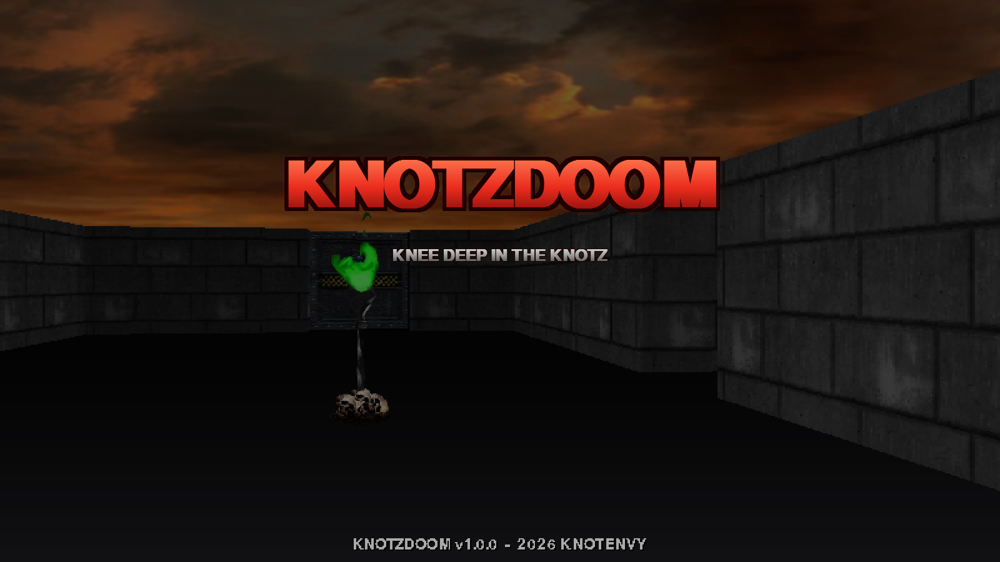
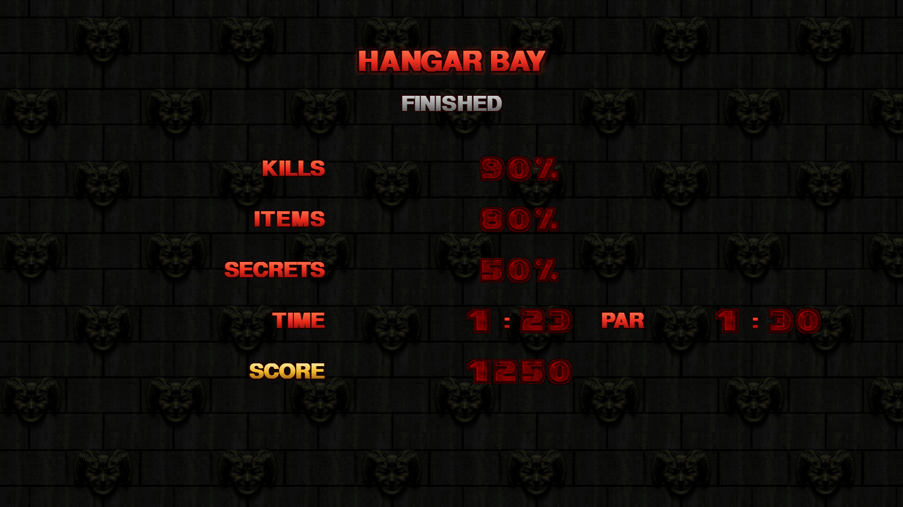
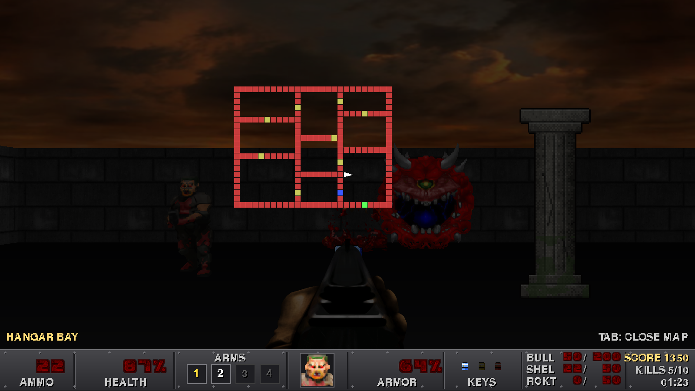

# KnotzDoom

A complete Doom-style first person shooter written in Python with pygame: a
grid raycaster with sliding doors, depth-clipped billboard sprites, six
hand-built levels, four weapons, five monster types, keys, secrets, exploding
barrels, a Doom style status bar, intermission tallies, save games, cheats and
everything in between.


| Title | Intermission | Automap |
| --- | --- | --- |
|  |  |  |

## Running

```bash
pip install -r requirements.txt       # pygame + numpy
python main.py
```

Developers: `pip install -r requirements-dev.txt` adds pytest and pyflakes.

Python 3.10+ and pygame 2.5+ are required. The game runs at 1600x900 in a
window; fullscreen can be toggled with F11 or from the options menu.

## Controls

| Key | Action |
| --- | --- |
| W A S D / arrows | Move, strafe and turn |
| Mouse | Look around |
| Left mouse | Fire (hold for automatic weapons) |
| Shift | Sprint (or toggle "always run" in the options) |
| E / Space | Use doors, switches and secret walls |
| 1 - 4 / mouse wheel | Select weapon |
| Tab | Automap overlay |
| F5 / F9 | Quick save / quick load |
| F11 | Toggle fullscreen |
| F12 | Screenshot (saved to `screenshots/`) |
| Esc | Pause menu |

Classic cheats are typed during play: `iddqd` (god mode), `idkfa` (all weapons,
ammo, keys and armor), `idclip` (walk through walls) and `iddt` (reveal the map).

## The game

* **Six levels** in one episode, from the Hangar Bay to the Cyber Throne, with
  story text between them, par times and a final boss.
* **Weapons**: pistol, shotgun (7 pellets), chaingun and rocket launcher with
  splash damage that also hurts you.
* **Monsters**: troopers and sergeants (hitscan), cacodemons (fireballs), hell
  knights (fast melee) and the cyberdemon (rockets). Monsters see you, hear your
  gunfire, open doors, path around each other, flinch and leave corpses.
* **Doors** slide open and closed on their own, keycards lock them, secret
  doors hide in the walls and exit switches end the level.
* **Pickups**: stimpacks, medikits, soulspheres, two armor types, ammo, backpack
  and keycards. Exploding barrels chain-react.
* **Status bar** with the ammo, health, arms, face, armor, keys and ammo table
  layout you expect, plus messages, a crosshair and an automap.
* **Full game flow**: title screen with a live rotating 3D background, main
  menu, four skill levels, options (volumes, mouse sensitivity, screen shake,
  head bob, crosshair, fps cap, fullscreen), help and credits, intermission
  tally screens with ticking counters, a death screen, a victory screen with
  totals, and a scrolling credits roll. Four save slots plus quick save.
* **Juice**: distance shading, weapon bob and kick, head bob, muzzle flash
  lighting, screen shake, damage and pickup flashes, blood and bullet puffs,
  explosions, a camera that sinks to the floor when you die, level fade-ins.
* **Detail levels** like the original: the 3D view renders at full (1600x900,
  800 rays) or half resolution and scales up. `AUTO` (the default) drops to
  low detail when frames get slow and climbs back when there is headroom.

## Performance

The engine is pure Python on pygame surfaces, so every per-column and
per-sprite operation counts. After the optimisation pass (see `findings.md`
for the third-party review that drove it):

| Measurement (reference machine, headless) | Before | After |
| --- | --- | --- |
| Timedemo Blood Cathedral, high detail, mean frame | 11.5 ms | 6.0 ms |
| Timedemo Blood Cathedral, low detail, mean frame | 5.5 ms | 3.1 ms |
| Raycaster, 800 rays | 3.3 ms | 1.1 ms |
| Wall columns, 800 | 5.4 ms | 4.1 ms |
| Sprites at close range (6 monsters) | 9.4 ms | ~4 ms |
| Paused frame | 13.8 ms | 0.9 ms |
| Status bar | 0.34 ms | 0.04 ms |
| Peak memory with all weapons | ~240 MiB | ~140 MiB |

What changed: one DDA walk per ray over a flat cell list with tangent spaced
columns (shared by rendering, line of sight and hitscan), 1-texel wall strips
scaled straight into the view, sprites shaded before scaling through a small
LRU with colorkey blits, lazy per-texture shade banks, weapon frames scaled
once, an opaque pause screen, cached dims, a composed status bar and a cached
automap layer. Measure with:

```bash
python tools/timedemo.py e1m5 high     # replays the bot's route through the real draw path
python tools/perf_test.py 4 low        # per-phase breakdown
python -m pytest tests -m perf         # frame budget test
```

## The episode

| # | Level | Theme | Par |
| --- | --- | --- | --- |
| 1 | Hangar Bay | Gray brick loading docks, first doors, keys and a hidden soulsphere | 1:30 |
| 2 | Waste Tunnels | Mossy sewers, barrels, a cacodemon guarding the blue key | 2:30 |
| 3 | Command Center | Night-time tech base, chaingun, red then blue key hunt | 3:20 |
| 4 | The Furnace | Hell-brick reactor ring, rocket launcher, first hell knights | 4:00 |
| 5 | Blood Cathedral | Banner-lined nave, three wings, three keys | 5:00 |
| 6 | Cyber Throne | Guarded approach and a pillar arena against the cyberdemon | 4:00 |

Top-down previews of every map are in `screenshots/maps/` (regenerate with
`python tools/level_map.py`).

## Project layout

```
main.py                 entry point
knotzdoom/              the game package
  settings.py           resolution, FOV, paths, timing and gameplay constants, skill table
  config.py             user options with a validating schema (config.json)
  view.py               view geometry per detail level, auto detail controller
  assets.py             lazy shade banks, colorkey sprite frames, tints, weapon frames
  fonts.py              glowing red menu font, pixel font, digit font, bounded caches
  audio.py              sound effects with distance attenuation, music
  level.py              level JSON loading, grid legend, validator
  raycasting.py         one DDA walk shared by rendering, line of sight and hitscan
  renderer.py           sky, floor, walls, depth clipped sprites, overlays
  sprites.py            billboards, animations, particles
  player.py             movement, inventory, damage, use action
  weapons.py            weapon table and first person weapon view
  npc.py                monster AI state machine
  projectiles.py        fireballs and rockets
  pickups.py            items, props, barrels (table driven effects)
  pathfinding.py        flow field breadth-first search
  objects.py            entity spawning and updates
  world.py              one loaded level: grid, doors, effects, combat, stats, saves
  hud.py                cached status bar, messages, crosshair, automap layer
  ui/                   screens: menu widgets, demo backdrop, title/options/tally, play/pause/death
  flow.py               new game, level sequencing, tallies, ending, save and load
  saves.py              atomic, validated save slots with level fingerprints
  game.py               window, clock, state stack, main loop
levels/                 episode.json + one JSON file per level (ASCII grids)
resources/              textures, sprites, sounds, music
tools/gen_assets.py     procedural generator for the new art, sounds and music
tools/optimize_assets.py  resizes / re-saves shipped images to what the engine samples
tools/smoke_test.py     headless walkthrough of every state with screenshots
tools/autoplay.py       bot that completes a level with the real collision code
tools/timedemo.py       frame time replay of the bot's route (mean, median, p95, max)
tools/perf_test.py      per-phase frame time breakdown
tools/level_map.py      top-down level previews
tests/                  pytest suite: levels, raycasting, AI, saves, regressions, golden frames, flow
findings.md             third-party performance and code review with status per finding
```

## Making levels

Levels are plain JSON with an ASCII grid; the legend is documented at the top
of `knotzdoom/level.py`. Run the validator to check connectivity, key order
and placement:

```bash
python -c "from knotzdoom.level import load_level, validate_level; print(validate_level(load_level('e1m2')))"
```

## Tests

```bash
python -m pytest tests
```

The suite runs headless (SDL dummy drivers), keeps its config, saves and
records in a temporary directory, and includes a full walkthrough of the game,
a bot playthrough of every level, golden-image checks of the renderer (set
`KNOTZDOOM_UPDATE_GOLDEN=1` after an intentional visual change) and a frame
budget test behind the `perf` marker.

## Regenerating the generated assets

The new wall textures, pickups, projectiles, first person weapons, sound
effects and music loops are produced procedurally so they match the original
pixel-art style:

```bash
python tools/gen_assets.py --contact-sheet /tmp/assets.png
```
